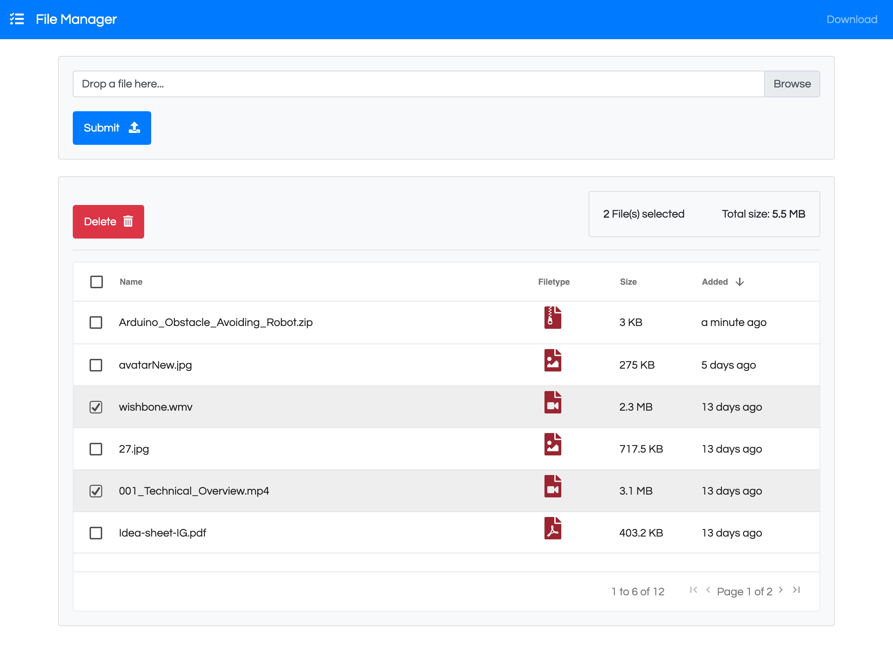

# FileManager 

<div style="text-align:center"></div>

## Description

> A file manager web app with Django rest framework in backend and Vue.js in frontend with ag-grid data tables integration.

## System Requirements
* Python 3.6+
* pip
* virtualenv
* Node.js

## Dependencies
See [requirements.txt](https://github.com/anb10991/filemanager/blob/master/requirements.txt) for more information.

## Build Instructions

1. Clone the repository and get into the directory
```
git clone https://github.com/talented/FileManager.git
cd filemanager
```
2. Create a virtual environment
```
(OSX)
python3 -m venv .env

(Linux)
virtualenv .env
```

3. Activate virtual environment
```
. .env/bin/Activate
```

4. Install modules by running 'requirements.txt'
```
pip install -r requirements.txt
```

5. Setup for vue.js
```
npm install
```

## How To Start

1.  Run `npm run build`
2.  Run `python manage.py migrate`
3.  Run `python manage.py runserver`
4.  Open your browser using the url: [http://127.0.0.1:8000/](http://127.0.0.1:8000/)

## TO DO's

1. Dockerize the app
2. Deploy to AWS with S3
